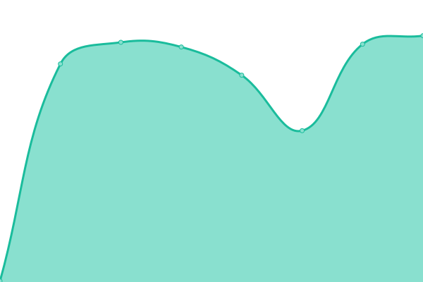

# [📈 Live Status](https://status.stemmechanics.com.au): <!--live status--> **🟩 All systems operational**

This repository contains the open-source uptime monitor and status page for [STEMMechanics](https://stemmechanics.com.au/), powered by [Upptime](https://github.com/upptime/upptime).

With [Upptime](https://upptime.js.org), you can get your own unlimited and free uptime monitor and status page, powered entirely by a GitHub repository. We use [Issues](https://github.com/STEMMechanics/upptime/issues) as incident reports, [Actions](https://github.com/STEMMechanics/upptime/actions) as uptime monitors, and [Pages](https://status.stemmechanics.com.au) for the status page.

<!--start: status pages-->
<!-- This summary is generated by Upptime (https://github.com/upptime/upptime) -->
<!-- Do not edit this manually, your changes will be overwritten -->
<!-- prettier-ignore -->
| URL | Status | History | Response Time | Uptime |
| --- | ------ | ------- | ------------- | ------ |
|  [STEMMechanics Website](https://www.stemmechanics.com.au) | 🟩 Up | [stem-mechanics-website.yml](https://github.com/STEMMechanics/upptime/commits/HEAD/history/stem-mechanics-website.yml) | 

 1391ms
     
 | 

<a href="https://status.stemmechanics.com.au/history/stem-mechanics-website">100.00%</a>
    

|  [STEMMechanics Database](db.stemmechanics.com.au) | 🟩 Up | [stem-mechanics-database.yml](https://github.com/STEMMechanics/upptime/commits/HEAD/history/stem-mechanics-database.yml) | 

 202ms
     
 | 

<a href="https://status.stemmechanics.com.au/history/stem-mechanics-database">100.00%</a>
    

|  [Drustcraft Server](play.drustcraft.com.au) | 🟩 Up | [drustcraft-server.yml](https://github.com/STEMMechanics/upptime/commits/HEAD/history/drustcraft-server.yml) | 

 232ms
     
 | 

<a href="https://status.stemmechanics.com.au/history/drustcraft-server">100.00%</a>
    

|  [Drustcraft Website](https://www.drustcraft.com.au) | 🟩 Up | [drustcraft-website.yml](https://github.com/STEMMechanics/upptime/commits/HEAD/history/drustcraft-website.yml) | 

 713ms
     
 | 

<a href="https://status.stemmechanics.com.au/history/drustcraft-website">100.00%</a>
    

|  [Drustcraft API](https://api.drustcraft.com.au) | 🟩 Up | [drustcraft-api.yml](https://github.com/STEMMechanics/upptime/commits/HEAD/history/drustcraft-api.yml) | 

 667ms
     
 | 

<a href="https://status.stemmechanics.com.au/history/drustcraft-api">100.00%</a>
    

|  [Drustcraft Map](https://map.drustcraft.com.au) | 🟩 Up | [drustcraft-map.yml](https://github.com/STEMMechanics/upptime/commits/HEAD/history/drustcraft-map.yml) | 

 651ms
     
 | 

<a href="https://status.stemmechanics.com.au/history/drustcraft-map">100.00%</a>
    

<!--end: status pages-->

[**Visit our status website →**](https://status.stemmechanics.com.au)

## 📄 License

- Powered by: [Upptime](https://github.com/upptime/upptime)
- Code: [MIT](./LICENSE) © [STEMMechanics](https://stemmechanics.com.au/)
- Data in the `./history` directory: [Open Database License](https://opendatacommons.org/licenses/odbl/1-0/)
