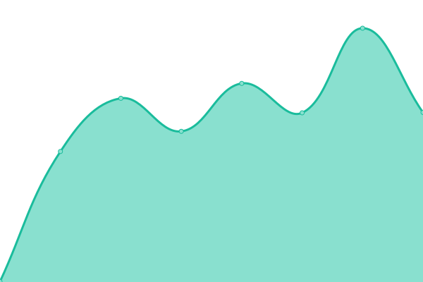

# [📈 Live Status](https://status.stemmechanics.com.au): <!--live status--> **🟩 All systems operational**

This repository contains the open-source uptime monitor and status page for [Upptime](https://upptime.js.org), powered by [Upptime](https://github.com/upptime/upptime).

With [Upptime](https://upptime.js.org), you can get your own unlimited and free uptime monitor and status page, powered entirely by a GitHub repository. We use [Issues](https://github.com/upptime/upptime/issues) as incident reports, [Actions](https://github.com/stemmechanics/upptime/actions) as uptime monitors, and [Pages](https://status.stemmechanics.com.au) for the status page.

<!--start: status pages-->
<!-- This summary is generated by Upptime (https://github.com/upptime/upptime) -->
<!-- Do not edit this manually, your changes will be overwritten -->
<!-- prettier-ignore -->
| URL | Status | History | Response Time | Uptime |
| --- | ------ | ------- | ------------- | ------ |
|  [Website](https://www.stemmechanics.com.au) | 🟩 Up | [website.yml](https://github.com/STEMMechanics/upptime/commits/HEAD/history/website.yml) | 

 1086ms
     
 | 

<a href="https://status.stemmechanics.com.au/history/website">96.90%</a>
    

|  [Database](db.stemmechanics.com.au) | 🟩 Up | [database.yml](https://github.com/STEMMechanics/upptime/commits/HEAD/history/database.yml) | 

 186ms
     
 | 

<a href="https://status.stemmechanics.com.au/history/database">100.00%</a>
    

|  [Minecraft](minecraft.stemmechanics.com.au) | 🟩 Up | [minecraft.yml](https://github.com/STEMMechanics/upptime/commits/HEAD/history/minecraft.yml) | 

 180ms
     
 | 

<a href="https://status.stemmechanics.com.au/history/minecraft">100.00%</a>
    

|  [GW-BNE-01](http://gw-bne-01.stemmechanics.com.au) | 🟩 Up | [gw-bne-01.yml](https://github.com/STEMMechanics/upptime/commits/HEAD/history/gw-bne-01.yml) | 

 451ms
     
 | 

<a href="https://status.stemmechanics.com.au/history/gw-bne-01">100.00%</a>
    

|  [GW-CNS-01](http://gw-cns-01.stemmechanics.com.au) | 🟩 Up | [gw-cns-01.yml](https://github.com/STEMMechanics/upptime/commits/HEAD/history/gw-cns-01.yml) | 

 1169ms
     
 | 

<a href="https://status.stemmechanics.com.au/history/gw-cns-01">99.47%</a>
    

|  [GW-CNS-02](http://gw-cns-02.stemmechanics.com.au) | 🟩 Up | [gw-cns-02.yml](https://github.com/STEMMechanics/upptime/commits/HEAD/history/gw-cns-02.yml) | 

 1105ms
     
 | 

<a href="https://status.stemmechanics.com.au/history/gw-cns-02">99.48%</a>
    

<!--end: status pages-->

[**Visit our status website →**](https://status.stemmechanics.com.au)

## 📄 License

- Powered by: [Upptime](https://github.com/upptime/upptime)
- Code: [MIT](./LICENSE) © [Anand Chowdhary](https://anandchowdhary.com), supported by [Pabio](https://pabio.com)
- Data in the `./history` directory: [Open Database License](https://opendatacommons.org/licenses/odbl/1-0/)
